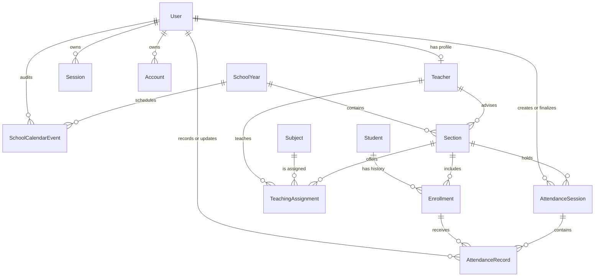

# Attendify Entity Relationship Diagram

## Parent, children, and cardinality

| Model | Parent | Children | Cardinality |
| --- | --- | --- | --- |
| User | None | Teacher, Session, Account, audited domain records | User 1 → 0..1 Teacher; User 1 → 0..N children |
| Session | User | None | User 1 → 0..N Sessions; Session → exactly 1 User |
| Account | User | None | User 1 → 0..N Accounts; Account → exactly 1 User |
| Verification | None | None | Independent, short-lived token record |
| Teacher | User | Section, TeachingAssignment | User 1 → 0..1 Teacher; Teacher 1 → 0..N children |
| Student | Audit Users | Enrollment | Student 1 → 0..N Enrollments |
| SchoolYear | Audit Users | Section, SchoolCalendarEvent | SchoolYear 1 → 0..N children |
| Section | SchoolYear, Teacher, Audit Users | Enrollment, AttendanceSession, TeachingAssignment | Each child belongs to exactly 1 Section |
| Subject | Audit Users | TeachingAssignment | Subject 1 → 0..N TeachingAssignments |
| TeachingAssignment | Section, Subject, Teacher, Audit Users | None | Each assignment has exactly 1 of each parent |
| Enrollment | Student, Section, Audit Users | AttendanceRecord | Enrollment 1 → 0..N AttendanceRecords |
| AttendanceSession | Section, creator/updater/finalizer Users | AttendanceRecord | Session 1 → 0..N AttendanceRecords |
| AttendanceRecord | AttendanceSession, Enrollment, recording/updating Users | None | Record belongs to exactly 1 session and 1 enrollment |
| SchoolCalendarEvent | SchoolYear, Audit Users | None | Event belongs to exactly 1 SchoolYear |

## Relationship rationale

- `Enrollment`, rather than `Student.sectionId`, allows a learner to transfer between sections without rewriting attendance history.
- `AttendanceRecord` joins a daily `AttendanceSession` with an `Enrollment`, making one record per learner/session enforceable while retaining the class context.
- `TeachingAssignment` prevents duplicated subject, teacher, and section data while supporting multiple subjects per section and teacher workloads.
- Teacher and adviser references use the `Teacher` extension instead of generic users, preventing non-teacher accounts from being assigned to instructional responsibilities.
- Audit relationships point to `User` because administrators may create, update, or finalize domain records even when they do not have a teacher profile.
